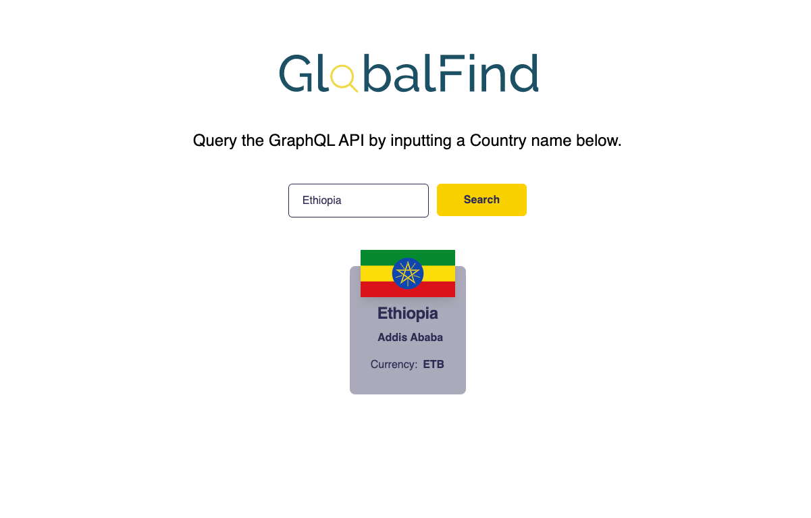

<div align="center">
	<h2>GlobalFind -- a NextJS App with GraphQL API</h2>
</div>



> [Live Preview](https://global-find.netlify.app/)

### ⚡️ Features

- Get details of a country using GeoDB, a GraphQL API.


### 🛠️ Installation Steps

1. Download the source code above. 

2. Unzip the downloaded file and navigate to the working directory.

3. Install dependencies

```bash
npm install
```

4. Create `.env.local` file in root and add your RapidAPI key.

```bash
NEXT_PUBLIC_RAPIDAPI_KEY=YOUR_RAPID_API_KEY
```

5. Run the app

```bash
npm run dev
```

You are all set! Open [localhost:3000](http://localhost:3000/) to see the app.
